# Learning Center
An AngularJS Spring REST API web application where students could take a course and track their progress towards completion

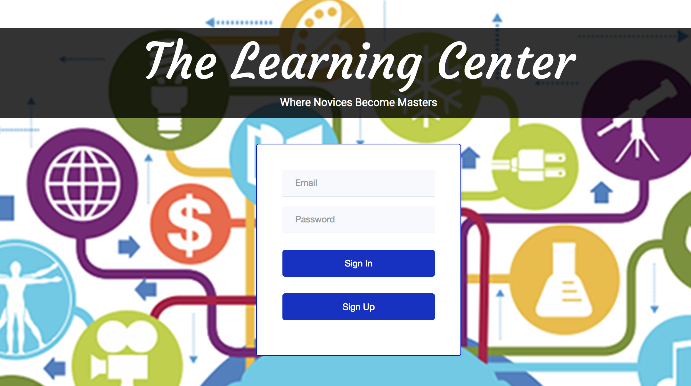

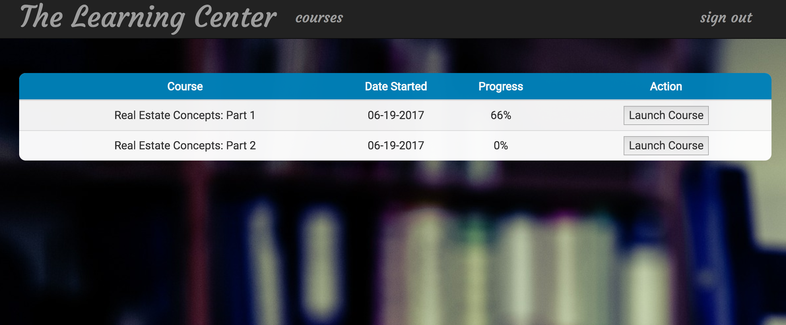

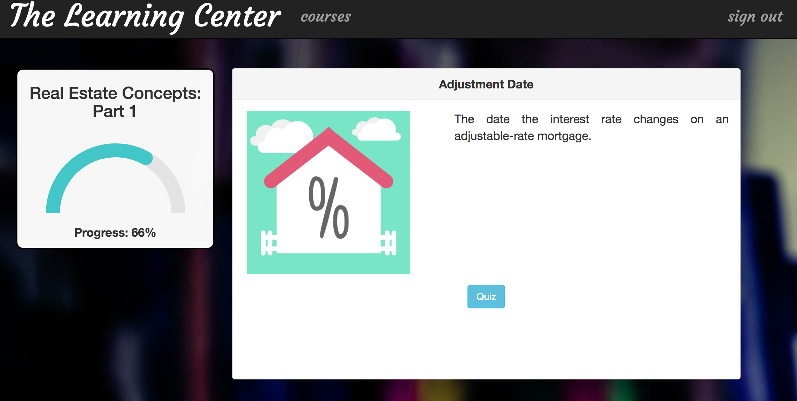

## In This Document:
1. [Application URL](#application-url)
2. [How to Use the Application](#how-to-use-the-application)
3. [Technologies Used](#technologies-used)
4. [Data Model](#data-model)
5. [Showing Progress: End-to-End Exploration](#showing-progress-end-to-end-exploration)

## Application URL
http://shaundashjian.com:8080/LearningCenter

## How to Use the Application
* Student logs in with his email and password
* The landing page shows all the courses the student is currently enrolled in, each showing the progress as a percentage of completion 
* Student could click on "Launch Course" to open the course page
* In the course page, student learns by reading the material in each page and then taking a quiz to test his knowledge
* The progress graph on the left shows how much has the student completed as a percentage of the overall content of the course
* After answering each quiz correctly, the student could move to the next part in the course
* After the student answers the last question in the course correctly, he graduates from the course

## Technologies Used
  * AngularJS
  * Spring REST web services
  * Angular SVG round progressbar, by https://github.com/crisbeto/angular-svg-round-progressbar
  * AJAX, using AngularJS's $http service
  * Java
  * HTML, CSS, Bootstrap, and JavaScript
  * JPA and Hibernate
  * JPQL
  * SQL
  * JUnit

## Data Model
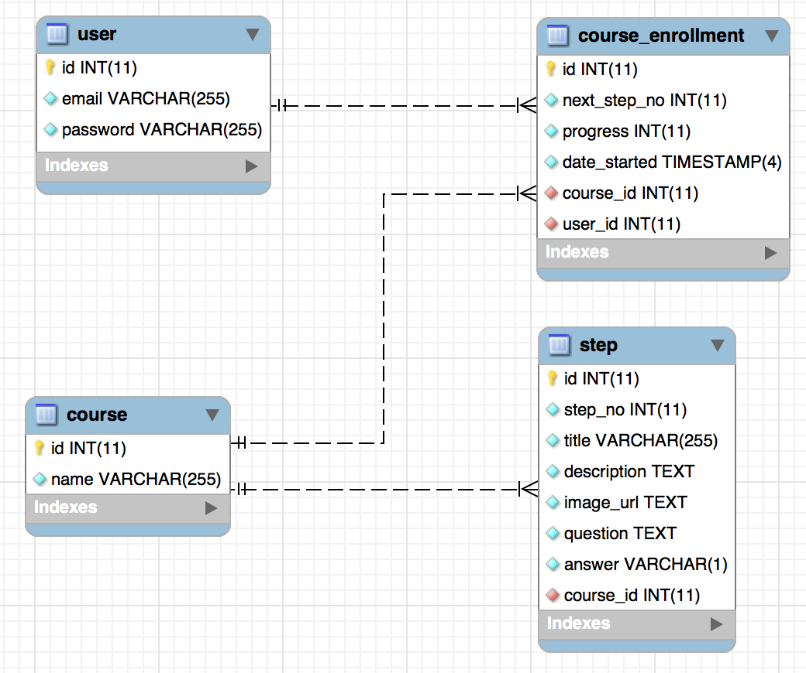

## Showing Progress: End-to-End Exploration:
  * Purpose: This feature shows students what their progress is throuout the course
  
  * End-to-End Implementation How To:
  1. I implemented this feature starting from the front-end. I spent some time thinking about how I want the progress feature to look like. I decided on a semi-circle progress bar to be displayed below the course name on the left side of the screen. This bar would change as the student progresses throughout the course. This was the design I had in mind:
  
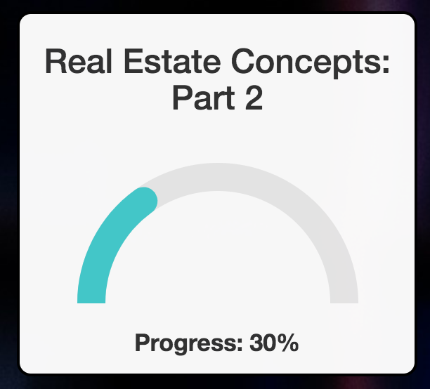
    
  2. I searched and found various JS and AngularJS libraries for progress bars. I liked the Angular SVG round progressbar, by https://github.com/crisbeto/angular-svg-round-progressbar . I played with it to make sure it fits my purpose.
  
  3. I added the AngularJS component (controller and template) to show the progress. First, since this was still a prototype, I used mock data in the JavaScript code.
  
  4. When that worked, I refactored my code, adding a service on the AngularJS side, and moved the mock data there.
  
  5. Now that I got the proof of concept working. I started developing the back-end. I added a table to the database for course enrollment which will hold the progress in a column:
  
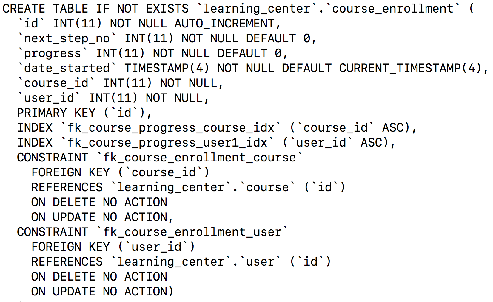
    
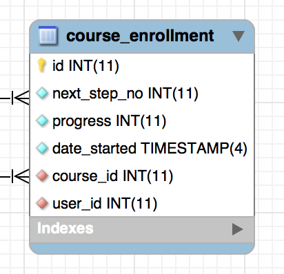
    
  6. To do CRUD, I added an entity in my JPA project which mapped the 'course_enrollment' table to the 'courseEnrollemnt' object. Hibernate works behind the scenes to build the SQL queries.
  
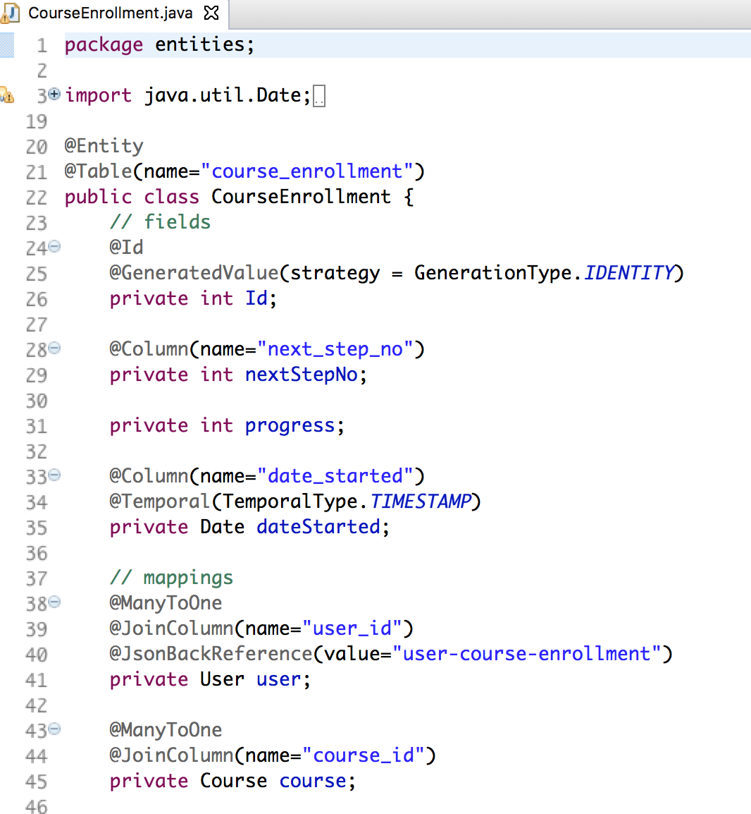
    
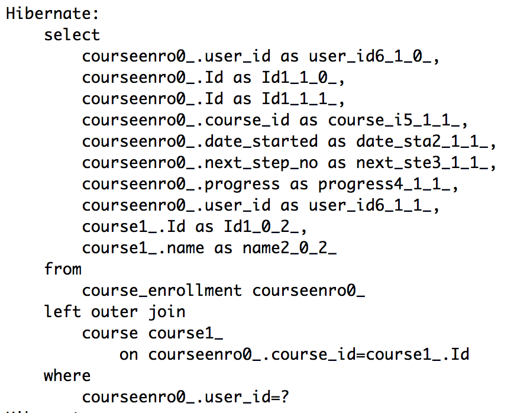
    
  7. After adding my JUnit tests in the JPA project and seeing all tests pass to make sure the connection and mapping works, I moved to the Spring REST side.
  
  8. I added a dao (Data Access Object) and controller. The dao takes care of communicating with the JPA entity, using JPQL (Java Persistence Query Language) to query and pass the Java objects. The controller takes care of routing the http requests to the dao. The dao dependency is injected into the controller as a bean. That bean is included in the Spring -servlet.xml file.
  
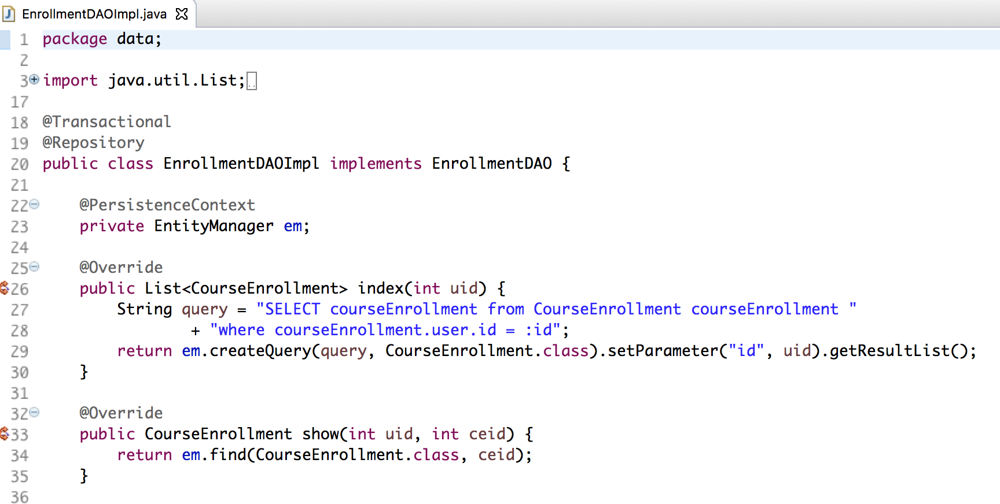
    
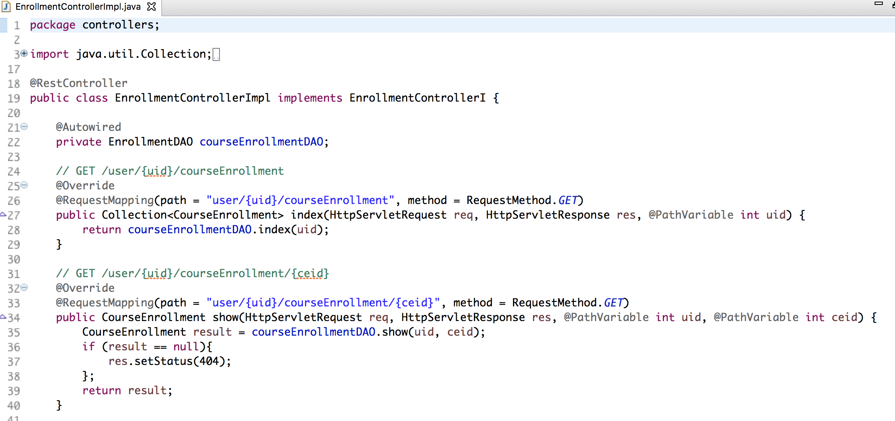
    
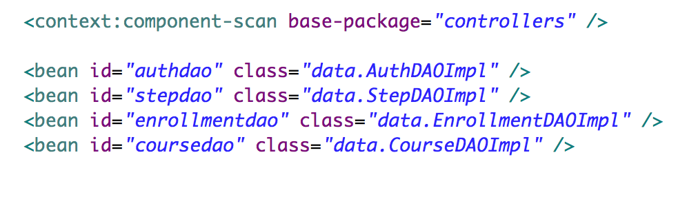
    
  9. After testing the various routes for the REST API using Postman, now it was time to hook the front-end AngularJS service with the back-end REST API. The AngularJS service now sends $http requests to the REST API and gets back promises that eventaully gets the data from the API. Those requests replaced the static mock data that I started with to develop the proof of concept and the core front-end design.
  
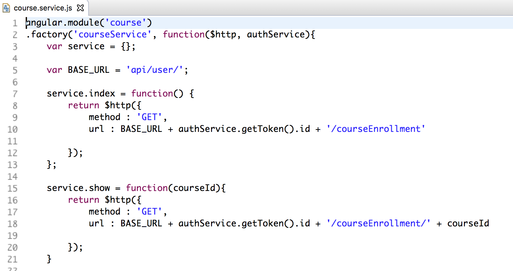
    
  10. AngularJS components now can use the data they get from the REST API, via the service to read the latest stored progress data and display it to the user, and also to update the progress in the database as the user moves through the course. The change happens in real-time. The progress bar changes to reflect the change, and the change persists in the database.
  
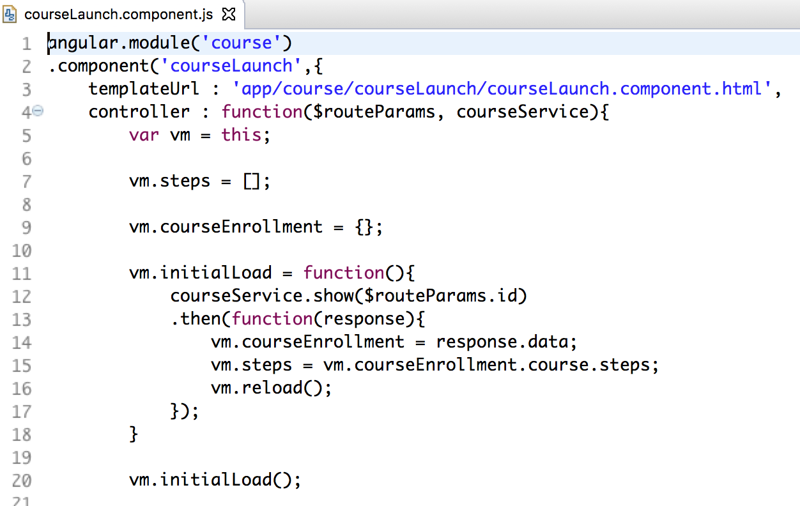
    
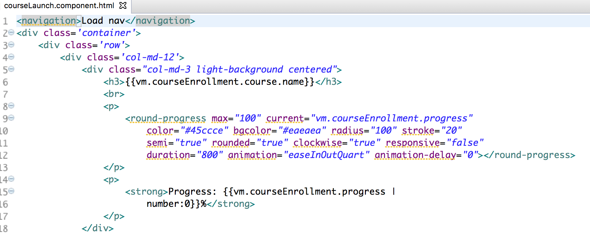
    
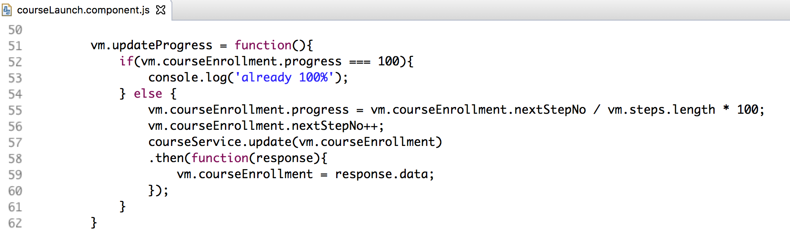

  

[Up](README.md)
